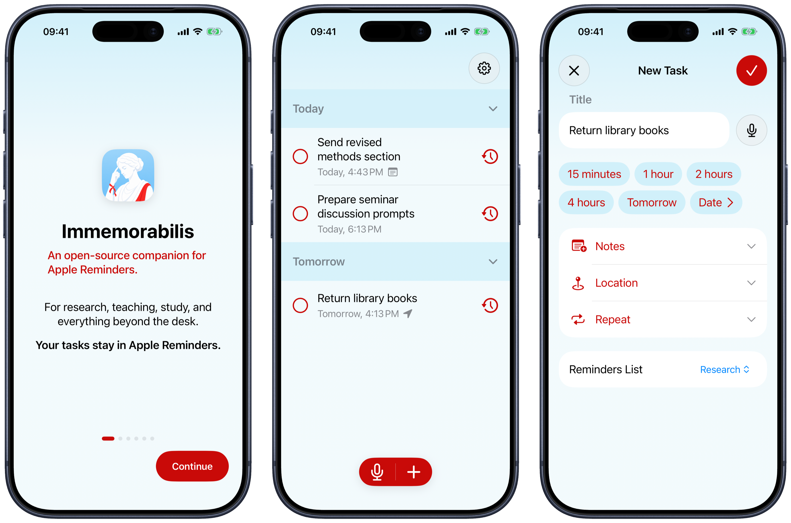

# Immemorabilis

<p align="center">
  
</p>

<p align="center"><strong>An open-source companion for Apple Reminders.</strong></p>

Immemorabilis is an open-source companion for Apple Reminders. It was made with research, teaching, and study in mind, but it works just as well for errands and everyday tasks.

Apple Reminders remains the backing store. Immemorabilis adds faster capture, natural-language dates, dictation, flexible recurrence rules, and widgets. It does not diagnose users or turn missed tasks into a moral judgment.

## Name and icon

`Immemorabilis` comes from Latin and is used here in the sense of **unforgetful**: something that does not let a memory slip away.

The icon depicts **Mnemosyne** (also written *Mnemosine*), the ancient Greek personification and Titaness of memory. In Greek mythology she is the mother of the nine Muses, figures associated with poetry, history, music, and the arts. That makes her a fitting symbol for a reminder app.

## Screenshots

<p align="center">
  
</p>

<p align="center"><sub>Framed with <a href="https://github.com/viticci/frames-cli">frames-cli</a> by Federico Viticci, using official Apple product bezels.</sub></p>

## Features

- Natural-language date and time parsing for typed reminders
- Dictation in multiple languages
- Notes with tappable URLs
- Recurrence rules for last day, first/last weekday, and first/last non-weekday of a month
- Home Screen widgets with add and dictate actions
- Local notifications, snoozing, list selection, and location-based reminder details
- Red and blue accent choices
- System-aware first weekday and persistent collapsed sections
- Apple Reminders and iCloud as the backing store

## Clone

~~Subscribe for USD 19.99/year to unlock `git clone`.~~

Actually:

```sh
git clone https://github.com/ezefranca/Immemorabilis.git
cd Immemorabilis
```

No Midas touch required.

## Build

Requirements:

- macOS with Xcode 26.6 or later
- An iOS 26.5 or later device or Simulator
- An Apple development team if you want to run on a physical device

Open the project:

```sh
open Immemorabilis/Immemorabilis.xcodeproj
```

In Xcode:

1. Select the **Immemorabilis** scheme.
2. Choose an iPhone or iPad destination.
3. If needed, select your development team for the app and widget targets.
4. Build and run with <kbd>⌘R</kbd>.

The app requests Reminders and notification access when those features are used. Dictation additionally needs microphone and speech-recognition permission.

## Tests

Run the unit and UI test plans from Xcode with <kbd>⌘U</kbd>. You can also select individual test targets in the Test navigator.

## Website

The static site lives in [`pages`](pages) and is deployed to [immemorabilis.ezequiel.app](https://immemorabilis.ezequiel.app) by the GitHub Pages workflow in [`.github/workflows/pages.yml`](.github/workflows/pages.yml).

To preview it locally:

```sh
python3 -m http.server 8000 --directory pages
```

Then open `http://localhost:8000`.

## Product principles

- Immemorabilis is reminder software, not a medical device or diagnostic tool.
- A person’s mental health, disability, or suspected neurodivergence is not a marketing shortcut.
- Forgetting is not a moral failure, and overdue tasks do not need a shame loop.
- Pricing should be clear, proportionate, and capable of reading the room.

See the website’s [Terms of Use](https://immemorabilis.ezequiel.app/terms/) and [Privacy Policy](https://immemorabilis.ezequiel.app/privacy/) for the full plain-language versions.

## Contributing

[GitHub Issues](https://github.com/ezefranca/Immemorabilis/issues) are the community space for questions, ideas, bug reports, and discussion. Focused pull requests are welcome too. Please keep changes accessible, native to Apple platforms, and consistent with the principles above. When reporting a bug, do not include private reminder content or health information.

## License

The project is available under the [MIT License](LICENSE). The license permits forks; it does not grant permission to misrepresent one as the official app.
